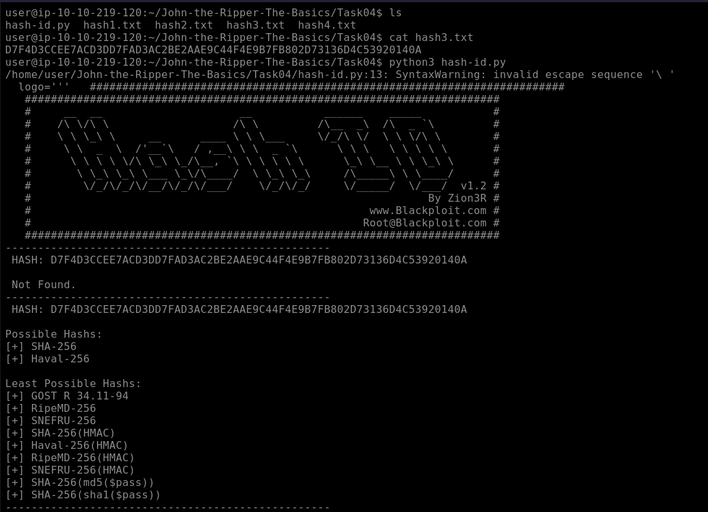
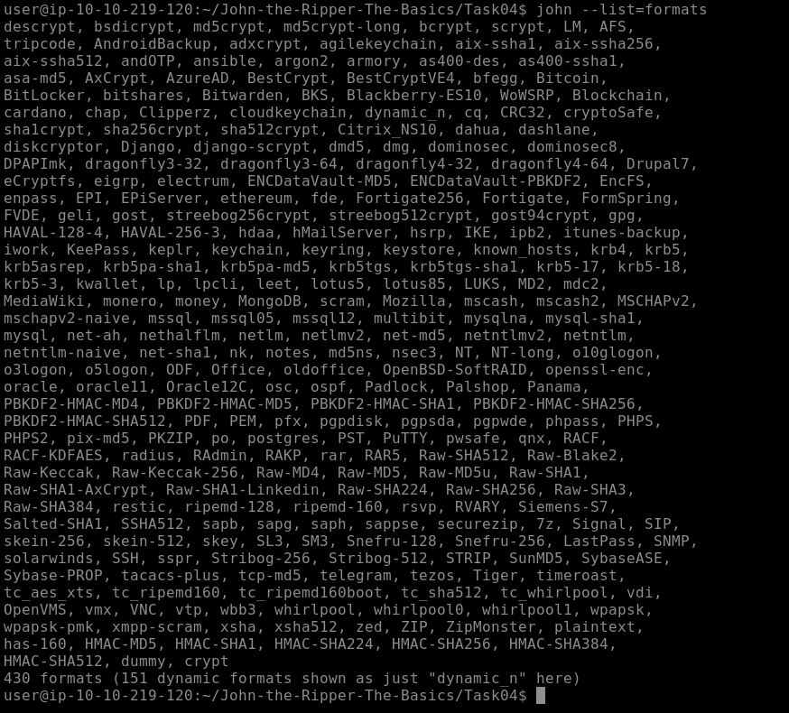
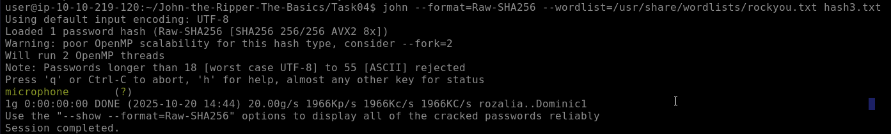
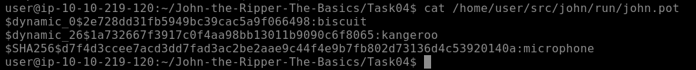

# CRACKING BASIC HASHES

1. We look for the hash in the file `hash3.txt`

```bash
cat hash3.txt
D7F4D3CCEE7ACD3DD7FAD3AC2BE2AAE9C44F4E9B7FB802D73136D4C53920140A
```

2. With hash-id.py we determine the hash type

```bash
python3 hash-id.py
D7F4D3CCEE7ACD3DD7FAD3AC2BE2AAE9C44F4E9B7FB802D73136D4C53920140A
```




We get that the hash type can be **SHA-256** or **Haval-256**.

3. Proceed to use John the Ripper, telling it to use the SHA256 format

```bash
john --list=formats
```



```bash
john --format=Raw-SHA256 --wordlist=/usr/share/wordlists/rockyou.txt hash3.txt
```



4. Read the output that John the Ripper gives us to obtain the password

```bash
cat /home/user/src/john/run/john.pot
```



**FLAG:** `microphone` (you can see the previous two as well because they are saved in a list with everything John cracks)

---

**Short summary:** locate the hash file → identify possible hash algorithms with `hash-id.py` → run John the Ripper specifying `Raw-SHA256` and `rockyou.txt` wordlist → read `john.pot` to retrieve the cracked password (`microphone`).
