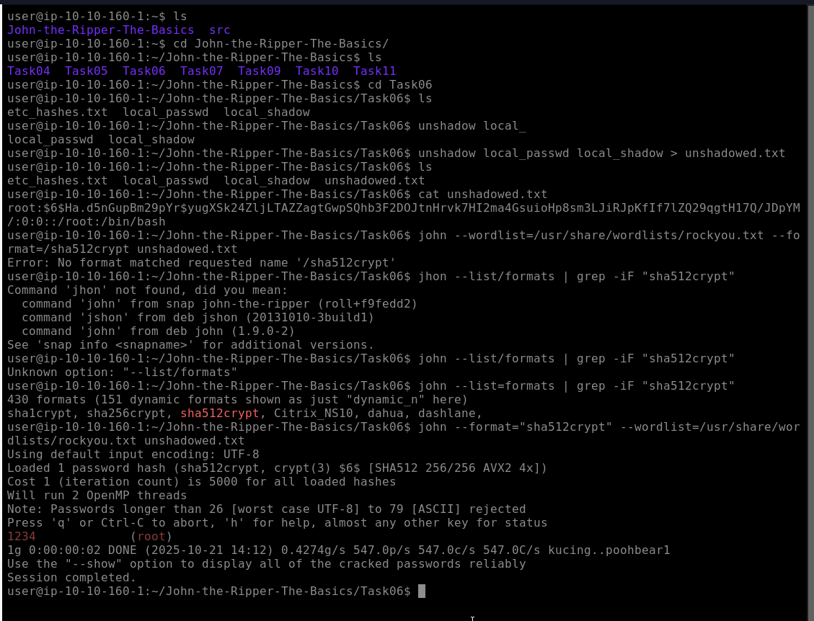

# Task 06 — Cracking hashes from /etc/shadow

**Objective:** Combine `/etc/passwd` and `/etc/shadow` (unshadow), then use John the Ripper to crack Linux password hashes (e.g. sha512crypt entries).

---

## Concept (short)
- `/etc/shadow` stores user password hashes (restricted to root).  
- John expects a combined format: use `unshadow` to merge `/etc/passwd` + `/etc/shadow` into a single file John can parse.

---

## Files for the lab
- Lab path: `~/John-the-Ripper-The-Basics/Task06/`  
- Provided file: `etchashes.txt` (contains the relevant `/etc/shadow` line(s) for the task).  
- If you have both files from a host, use them; otherwise extract the specific lines you need.

---

## Step-by-step commands (reproducible)

1. **List files**
```bash
ls -la ~/John-the-Ripper-The-Basics/Task06/
```

## Answer


