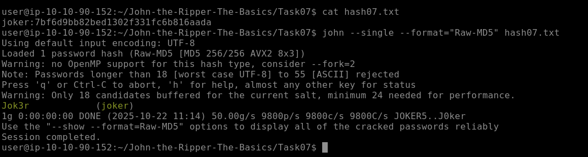

# RESPUESTA LAB

1. Since we are going to use single mode, we concatenate joker: to the hash of the file hash07.txt.

```bash
nano hash07.txt
result -> joker:7bf6d9bb82bed1302f331fc6b816aada
```

2. In this case, I copied the hash-id.py script to find out the hash format it uses, and I use it with the file.


```bash
python3 hash-id.py
```

As a result, we obtain that the possible hash is MD5.


3. We use John's single mode to crack the password.

```bash
john --single --format="Raw-MD5" hash07.txt
```



**FLAG**: Jok3r
