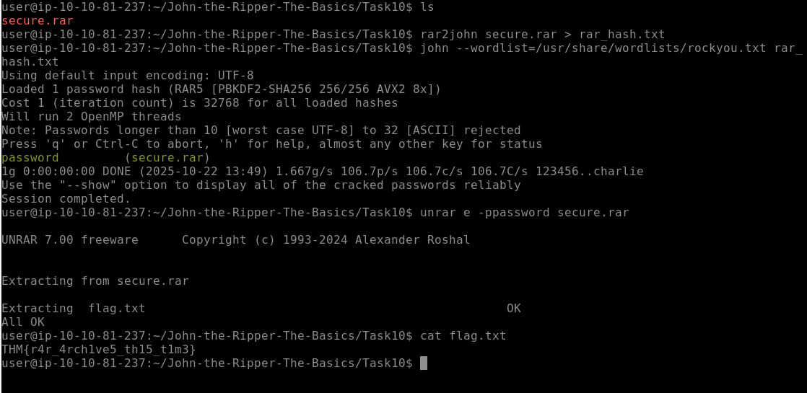

# Lab Documentation: Cracking Password-Protected RAR Archives

This lab demonstrates the process of cracking a password-protected RAR archive using the dedicated `rar2john` utility and the John The Ripper (JtR) password cracker. The goal was to retrieve the content of the hidden `flag.txt` file.

## 1. Environment and Hash Preparation

The first step was to locate the archive (`secure.rar`) and use the `rar2john` utility to convert the protected file into a hash format readable by John The Ripper. The output was redirected (`>`) to a file named `rar_hash.txt`.

```bash
ls
rar2john secure.rar > rar_hash.txt
cat rar_hash.txt
```

## 2. Cracking the Hash with John The Ripper
The generated hash file (rar_hash.txt) was then processed by John The Ripper using a dictionary attack against the rockyou.txt wordlist.


```bash
john --wordlist=/usr/share/wordlists/rockyou.txt rar_hash.txt
```
Cracked Password Output:

John successfully cracked the hash, revealing the password: `password`.

```user@ip-10-10-81-237:~/John-the-Ripper-The-Basics/Task10$ john --wordlist=/usr/share/wordlists/rockyou.txt rar_hash.txt
Using default input encoding: UTF-8
Loaded 1 password hash (RAR5 [PBKDF2-SHA256 256/256 AVX2 8x])
...
**password** (secure.rar)
...
Session completed.
```

## 3. Extracting the Flag File
With the password (password) confirmed, the final step was to use the unrar e utility to extract the contents, providing the password via the -p flag (no space). The flag.txt file was then read.

```bash
unrar e -ppassword secure.rar
cat flag.txt
```

Final Flag Retrieval:

```user@ip-10-10-81-237:~/John-the-Ripper-The-Basics/Task10$ unrar e -ppassword secure.rar

UNRAR 7.00 freeware      Copyright (c) 1993-2024 Alexander Roshal

Extracting from secure.rar

Extracting flag.txt                                                     OK
All OK
user@ip-10-10-81-237:~/John-the-Ripper-The-Basics/Task10$ cat flag.txt
THM{r4r_4rch1ve5_th15_t1m3}
```

## 4. Evidence

